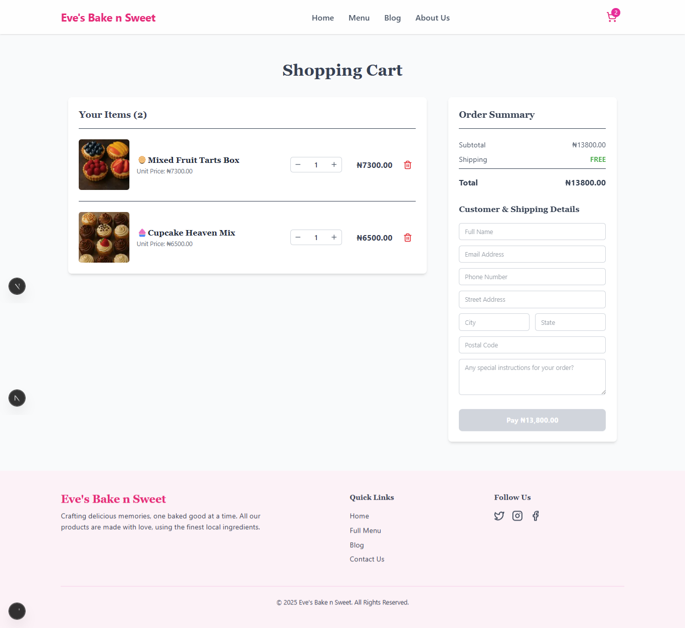
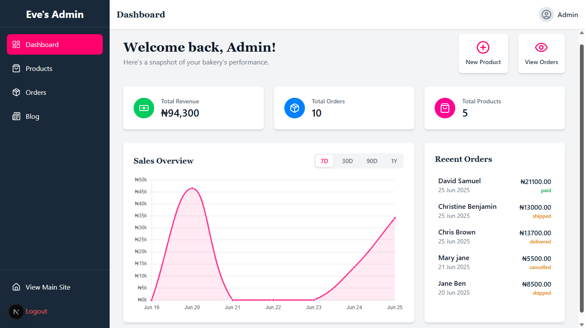

# Eve's Bake n Sweet 🍰

A full-stack e-commerce and content management application for a modern bakery. This project showcases a complete, production-ready solution featuring a beautiful user-facing storefront and a comprehensive, secure admin dashboard.

---

## ✨ Live Demo

**[Visit Demo site]**(https://www.evesbake.vercel.app.com)


---

## 📸 Application Preview

<div align="center">

**User-Facing Menu page**  
*A beautiful, animated, and responsive storefront designed to attract customers and showcase delicious baked goods.*  
<br/>  


<br/><br/>

**Cart Page**
*A beautiful, animated, and responsive cart page designed for customers to place orders.*
<br/>


<br/><br/>

**Admin Dashboard**  
*A powerful and secure dashboard for managing products, orders, blog content, and viewing sales analytics.*  
<br/>  


</div>

---

## 🚀 Core Features

### 🛒 User Storefront

- **Dynamic Homepage:** A fully animated hero section, featured products, and content sections that animate on scroll.
- **Product & Blog Discovery:** SEO-optimized pages for viewing the full menu and reading blog articles.
- **Shopping Cart:** A global state-managed cart where users can add items, update quantities, and see their total.
- **Secure Payments:** Integrated with **Paystack** for real, secure online payment processing.
- **Responsive Design:** Flawless user experience on all devices, from mobile phones to desktop computers.
- **Stunning Animations:** Built with **GSAP** for smooth, professional animations, including entrance effects, micro-interactions, and page transitions.

### ⚙️ Admin Panel

- **Secure Authentication:** Protected by **NextAuth.js** with a database-backed credentials provider.
- **Data-Driven Dashboard:** A central hub displaying real-time analytics like total revenue, order counts, and a filterable sales chart.
- **Full CRUD Functionality:**
  - **Products:** Add, edit, and delete products with multi-image uploads directly to **Cloudinary**.
  - **Orders:** View, search, and paginate through all orders. Update order status and view customer details. Admins can also create manual "offline" orders.
  - **Blog:** A complete CMS with a **Tiptap** rich text editor for creating, editing, and deleting blog posts with media uploads.
- **Modern Data Management:** Uses **TanStack Query (React Query)** for efficient, cached, and optimistic data fetching and mutations, leading to a fast and responsive UI.

---

## 🛠️ Tech Stack & Architecture

This project is built with a modern, full-stack architecture, all within the Next.js framework.

- **Framework:** **Next.js 14** (App Router)
- **Language:** **TypeScript**
- **Styling:** **Tailwind CSS**
- **Animations:** **GSAP** (GreenSock Animation Platform)
- **Database:** **MongoDB** with **Mongoose**
- **Authentication:** **NextAuth.js**
- **Data Fetching:** **TanStack Query (React Query)**
- **Payments:** **Paystack**
- **Image/Video Storage:** **Cloudinary**
- **Rich Text Editor:** **Tiptap**
- **Deployment:** **Vercel**

---

## ⚙️ Running Locally

Follow these steps to get the project running on your local machine.

### 1. Prerequisites

- Node.js (v18 or later)
- npm or yarn
- A MongoDB Atlas account (or a local MongoDB instance)
- A Cloudinary account
- A Paystack account

### 2. Clone the Repository

```bash
git clone https://github.com/symon9/eves-bake-n-sweet.git
cd eves-bake-n-sweet
```

### 3. Install Dependencies

```bash
npm install
```

### 4. Set Up Environment Variables

Create a `.env.local` file in the root of the project and add the following variables. Use the `.env.local.example` file as a guide.

```env
# MongoDB
MONGODB_URI="your_mongodb_connection_string"

# NextAuth
NEXTAUTH_SECRET="a_strong_random_secret"
NEXTAUTH_URL="http://localhost:3000"

# The base URL of your application
NEXT_PUBLIC_BASE_URL="http://localhost:3000"

# Paystack API Keys (use your test keys for development)
NEXT_PUBLIC_PAYSTACK_PUBLIC_KEY="pk_test_..."
PAYSTACK_SECRET_KEY="sk_test_..."

# Cloudinary Credentials
NEXT_PUBLIC_CLOUDINARY_CLOUD_NAME="your_cloud_name"
CLOUDINARY_API_KEY="your_api_key"
CLOUDINARY_API_SECRET="your_api_secret"
```

> **Note:** In your Cloudinary settings, ensure you have an **unsigned** upload preset named `eves_bake_n_sweet` for the file uploads in the forms to work.

### 5. Seed the Admin User

To create the first admin user in your database, run the seed script:

```bash
npx tsx src/script/seedAdmin.ts
```

The default credentials are empty fill it and run it e.g:

- **Email:** `admin@yourdomain.com`
- **Password:** `supersecretpassword`

*(You can change these in the `seedAdmin.ts` file)*

### 6. Run the Development Server

```bash
npm run dev
```

The application will be available at `http://localhost:3000`.

---

## 🌟 Acknowledgements

This project was built as a comprehensive showcase of modern full-stack web development techniques. Special thanks to the creators of Next.js, GSAP, and TanStack Query for their incredible tools.

---
